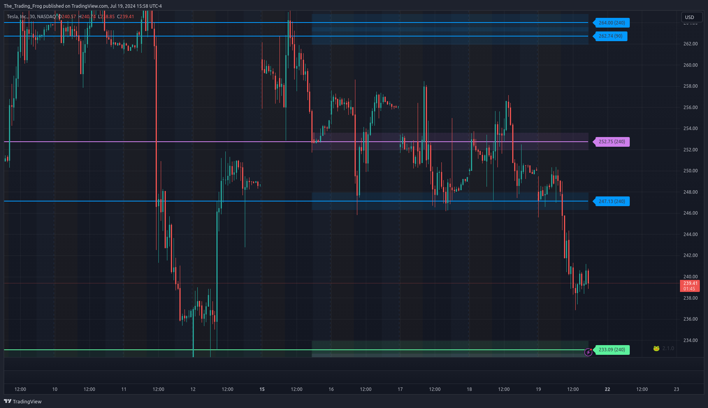
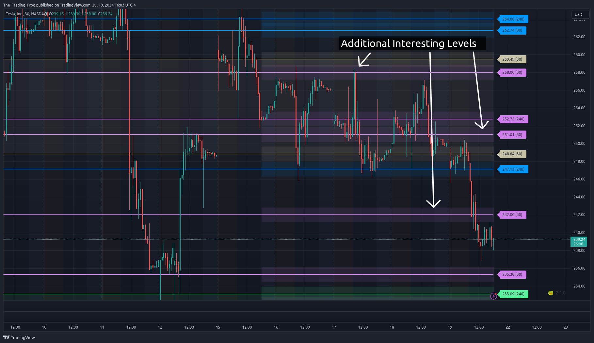
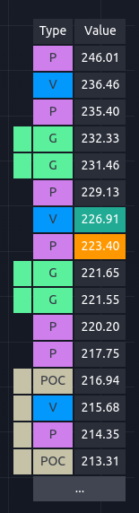
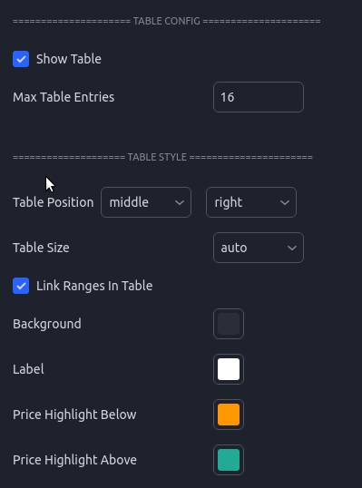
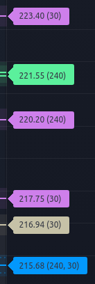

## Introduction

Each stock has its own personality and the indicator is designed to be flexible allowing you tune it for each chart. Learning when and how to adjust these settings can make a large impact in your success leveraging the indicator.

## Types of Lines

By default there are 4 types of levels represented on the chart.  These can be turned off and on individually in the settings. For example,  if you don't want to see the POC because you are already using another volume profile indicator you could disable that type from the settings. Each type of level is defined below:

* **■ Price Derived S/R ( P ):** These lines are derived from pivot points in the raw price data run through the S/R algorithm. 

* **■ Volume Derived S/R ( V ):** These lines are derived by using  intra-day volume to identify points of control. These daily areas of increased activity are then used to identify critical levels over the requested timeframe.

* **■ Point of Control ( POC ):** This range represents where the majority of intra-day volume occurred over the requested timeframe.

* **■ Developing Point of Control ( DPOC ):** This level is derived from the last 1+ days of volume data in realtime and shows where the most shares have been traded..

* **■ Gap ( G ):** These ranges show areas of gaps in the price action which often act as magnets. Gaps like to be closed.

* **■ Psychological ( M ):** Disabled By Default. These levels are typically nice round increments that traders flock to. As such they often act as areas of support and resistance.

* **■ Previous Day ( PD ):** Displays the previous days High, Low and Close on the chart and table.

* **■ Pre-Market ( PM ):** Displays the pre-market High, Low and Close on the chart and table.

# Setup

## Time-Frame Constraints

The indicator is designed to work on time frames of 5m to 1D. You will still see some lines on the 3m but many will be missing. Below 3m most lines will not load. With continuous contracts like crypto or futures, time-frames below 15m may fail to load all levels. It is always a good idea to start with 30m and work your way down to ensure you are not missing anything.

## Price Scale 

`This is a critical step do not skip it!`

The levels will cause the chart to scale improperly as TV tries to fit them all on the screen. To fix this, ensure “Scale price chart only” is selected. To bring up this menu on desktop, right click on the price scale ( see video below ). On mobile, long click on the price scale.

[filename](_media/line_scaling_example.webm ':include :type=video controls width=100% loop')

# Configuration

## Accessing the Settings

> To access the indicator settings you can either double click on one of the price labels or open the settings from the cog icon in the indicator drop down as seen in the video below.

[filename](_media/access_settings.webm ':include :type=video controls width=100% loop')

## Presets

There are many options for this indicator. To help get new users up and running there are several included presets.

* Analysis Presets affect Analysis Length Selection, merge lines of different types, and % diff for merging.
* Color Presets affect Line Style color selections. 
* Layout Presets affect a variety of visual settings.

> Hovering over the tool-tip next to each preset selection will provide more information about which settings are being used for that configuration.

## Line Merging

When stocks have a very tight range there will sometimes be levels which are very close together. This is especially true if you have many different time periods enabled.  The indicator supports merging levels that are close together into a new single line.  As you can see in the before and after allowing levels to be merged can clean up a noisy chart making it easier to read.

### Show Original Source Lines ‘Ghosts’

This will display the original levels as a faint dashed dotted line. Merging the lines can help to clean up a noisy chart but it is important to remember that these new merged levels should be treated like ranges. Having the original levels show faintly helps to drive this point home.

> 'Ghosts' have been made more opaque for this example. The default style is much fainter.  

### Merge Threshold

This values controls what is considered “Close Enough” to be merged. Behind the scenes this threshold is scaled for each ticker but that scaling isn’t always perfect. Adjusting the Merge Threshold allows the user to strike the perfect balance.

**How do you know when the 'Merge Threshold' should be adjusted?**

 The video below shows how changing the value affects the levels. At the start you will notice that there are a lot of levels that are essentially the same and are not adding new value to the chart. When the merge threshold is increased these duplicates disappear and the chart is easier to read while still retaining all the critical level information. At the end when the merge threshold is too high you will see that there has been a loss of detail where certain area are no longer captured. Striking this balance takes a bit of practice but once you have done it a few times it will become second nature.

[filename](_media/adjusting_merge_threshold_example.webm ':include :type=video controls width=100% loop')

 #### Small Caps

 For **Small** cap stocks ( Typically under $15 ) I have found the best 'Merge Threshold' normally falls between **1** and **3**

 #### Large Caps

For **Large** caps stocks ( Typically over $15 ) I have found the best 'Merge Threshold' normally falls between **.2** and **.5**

## Analysis Periods

These lines are generated by an external tool and then loaded into  TradingView. As such the levels are based on static ranges of price data. To allow for flexibility, multiple time ranges (number of bars) are analyzed and can be toggled in the settings.  A common way to leverage this is to study the chart and identify the range which captures the price movements you want to include in your SR analysi,s and then choose the length in the settings that encapsulates the range. You can enable as few or as many periods as you want.  

> Experiment with which timeframes are being displayed on each chart until you find the combination that seems to be most respected. 

 When a ticker is making new highs / lows, breaking out of its previous historical range, the lower timeframe analysis periods help to get more up to date levels. These shorter term levels 

> At the start of this video you can see that there is a bunch of price action above 220 where the longer analysis period levels have not caught up. By turning the 30 day levels on we can capture this price action.  

[filename](_media/showing_missing_lines_analysis_period_selection.webm ':include :type=video controls width=100% loop')

Below is an example where more granulatirty was needed. On this TSLA chart you can see that with only the 90 and 240 'Analysis Periods' enabled there are some areas of the chart that look like interesting pivots where the S/R indicator shows no lines. In this case it is worth turning on the 30 day levels to see if they help fill in the gaps.  It is often helpful to toggle the 30 day off and on for each cart to see if it fills critical price action gaps or just clusters the chart.

Missing levels             |  30 Period Levels Added
:-------------------------:|:-------------------------:
  |  

Another use case for shorter periods is if you are trying to scalp based on a large move in the last 1-4 days. In this case enabling the 5 day levels can show short term levels to day trade around.

## Level Table

The level table is another view of the price levels and is helpful for quickly identifying where the current price is relative to the support and resistance levels.  

The closest level above the current price will be highlighted in green ( by default ) and the closest level below the current price will be highlighted in yellow ( by default ).

Gaps and POC ranges are shown using the left most column to indicate that the values are connected and represent a range.

The table can be moved around or disabled. The number of rows can be limited which is helpful if you are trying to save screen real estate. 

Table UI                   |  Settings
:-------------------------:|:-------------------------:
 |  

## Level Labels

Each line on the chart has an associated label which can be tweaked and disabled to fit your visual preferences.  The labels contain not only the price but extra metadata.

If `'Include Analysis Length'` is enabled in the settings, each label will have a number inside parenthesis ex. ( 240 ). This number represents which analysis length was used to derive the level.  Some stocks will tend to respect certain lengths more than others so having this on the label can help inform how much confidence you put into each specific level.

After the analysis period there is a section for sub-type. This is primarily used for the Pre-Market and Previous Day levels to let you know what specifically each level represents.  

* **PD L** - Previous Day Low
* **PD H** - Previous Day High
* **PD C** - Previous Day Close
* **PM H** - Pre-Market High
* **PM L** - Pre-Market Low
* **PM O** - Pre-Market Open
  
Hovering over the label will display a pop-up with additional information including:

* The Type
* The Analysis Period
* If the level was merged with another, it will include the type and original prices from those levels.
* Ranges will show the top and bottom of the range.
* Diff Current Price - How far the current price is from this level as a percentage.

> A colon in the label shows that this level was merged with another of a different type. The values after the “:” will let you know the type that was merged. In the picture look at the Volume level in blue at 1.69. The “: P” at the end shows that this level merged with a Price level.

## Level Bands - Ranges

In the settings there is an option to enable Boxes around each level.  This will draw a box, in addition to a line, around each level to help remind you that the levels represent ranges and not exact values. Although you will often see price react to the levels very precisely, each level is calculated with a certain amount of uncertainty. Showing them as a box is a helpful reminder to not trade to the exact price shown.

The box sizing is scaled for each ticker based on an average of the tickers ADR or Average Daily Range. This works well for most, but for some tickers you may find the boxes are too small or large. In this case using the “Box Size Multiplier” will allow you to fine tune the box sizing.

You can also adjust the opacity in this section of the config.

> 'Ranges' have been made more opaque for this example. The default style is much fainter.  

# Strategies

## Support Becomes Resistance 

This is one of the most succesful strategies leveraging the indicator levels. The typical trade involes identifying a critical level ( one where consolidationg has happened at that level before breaking ). Scale in as price approaches the level and have a stop under the level. This allows for a very good risk to reward ratio. 

* Find an area of strong reaction where price jumps away from a level.
* Finding more than one reaction increases the strength of that level being strong
* Wait for the level to be breached.
* Wait for the price to retest this level and take the trade in the direction of the initial break
* Can be applied to all timeframes but 5 and 30 minutes works well for intraday

## GAP Rejection

* Gaps like to be filled but they also often act as resistance before getting filled.
* Gaps can be treated as strong resistance / support for reversal plays.

## DPOC Bounces

* The DPOC often acts as a strong support / resistance level and can be played as a bounce spot.
* Representing the highest volume node over the last X days this area represents where most of the shares have been traded.

## Final Stand

* This setup involves a level which has been tested many times. If it finally breaks through you can take a trade in the direction of the break with a tight stop above the level.
* This setup is better if there is an additional confluence, in the picture below there was a head and shoulders pattern forming.
* This setup can also be played as a `Support Becomes Resistance` play by waiting for a retest instead of playing the break directly.

# Updating The Indicator

The indicator receives frequent updates to fix bugs, optimize performance, and add new features. TradingView will send out an email each time an update is released.  The indicator on your chart will not automatically update. To apply the update, remove the indicator using the X as seen in the picture, restart TV / refresh the webpage, and then add the indicator back the same as you did the first time.  You will need to reconfigure your settings so take note of them before you update.

At the bottom right of your chart there is a version string. You can check that version against what is listed here on the website to ensure you are running the latest version.

> CURRENT VERSION: 2.1.0
