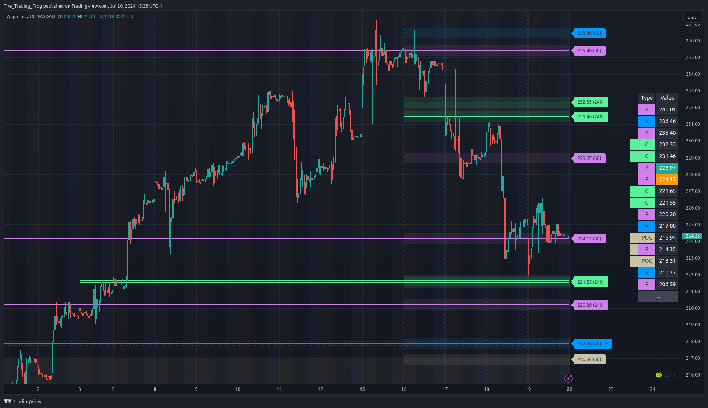
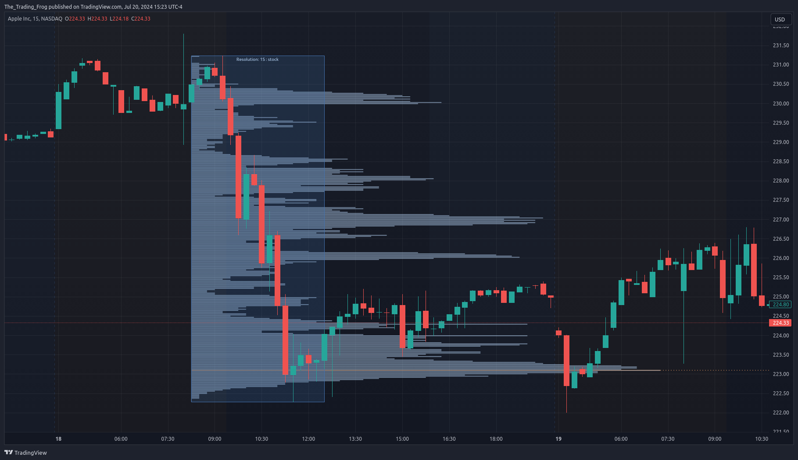

# The Indicators

You can find the documentation for both the Support / Resistance indicator and the Volume Profile indicator here including strategies for using them successfully and examples of trades. If you find any information missing please reach out and let me know!
  
[Support / Resistance Indicator](sr)            |  [Volume Profile Indicator](vpd)
:-------------------------:|:-------------------------:
  |  

# Strategies
A collection of strategies that leverage the S/R indicator, Volume Profile, and Fibonacci Retracements and Extensions.

[View Strategies](sr_strategies.md)

# Example Trades

A collection of trades showing off how to use the indicators.

[View Examples](examples.md)
