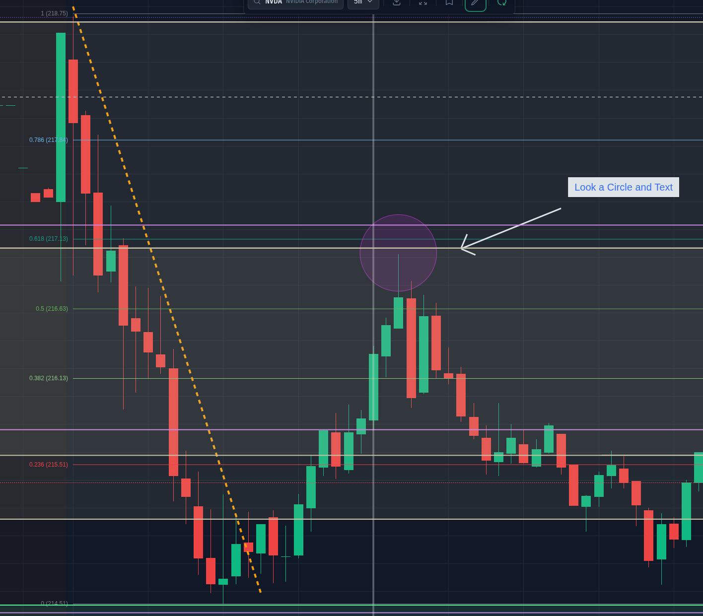
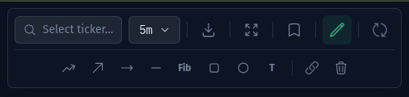
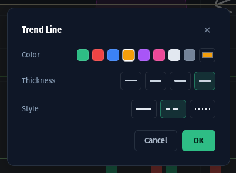

# Drawing Tools

The portal includes a full set of drawing tools for marking up your charts - trend lines, Fibonacci retracements, shapes and text - with TradingView-style editing, on desktop and mobile.

## Opening the Drawing Toolbar

Click the **pencil icon** in the chart toolbar to open the drawing row.

The tools, left to right:

| Tool | Description |
|------|-------------|
| **Trend Line** | Two-point line between any two prices |
| **Arrow** | Trend line with an arrowhead at the end |
| **Ray** | Line that extends forever past the second point |
| **Horizontal Line** | Infinite horizontal level at a price |
| **Fib** | Fibonacci retracement between a swing high and low |
| **Rectangle** | Box for marking zones (supply/demand, consolidation) |
| **Circle** | Circle or ellipse for highlighting areas |
| **T** | Text note, with optional background chip |

The two buttons on the right of the divider:

- **Magnet** (chain icon): when enabled, drawing points snap to the nearest OHLC price of the bar under your cursor - and to S/R levels. Toggle it off for free placement.
- **Trash**: removes every drawing on the current ticker and timeframe (with a confirmation).

## Drawing

1. Click a tool to arm it - the button highlights.
2. **Click-drag-release** on the chart: press to place the first point, drag to position the second (or the radius for circles), release to finish.
3. You can also **click, move, click** to place the two points separately.
4. Press **Escape** (or tap the armed tool again) to cancel a placement.

After a drawing is finished the tool disarms automatically, so the chart goes straight back to normal panning - just like TradingView.

Placing a **Text** note opens its settings immediately so you can type the content.

## Editing Drawings

- **Click a drawing** to select it - its anchor handles appear.
- **Drag a handle** to reshape: move a trend line's endpoints, resize a rectangle from its corners, or grab a circle's center to move it and its rim to resize.
- **Delete** or **Backspace** removes the selected drawing. A **red trash button** also appears at the bottom of the chart while a drawing is selected.
- Click empty chart space to deselect.

### Settings Dialog

**Double-click** any drawing to open its settings:

What you can edit depends on the tool:

- **Lines** (trend line, arrow, ray, horizontal line): color, thickness and style (solid, dashed, dotted)
- **Fib retracement**: enable/disable each level, edit level values and colors, and extend the level lines left or right
- **Rectangle & Circle**: background fill and border colors
- **Text**: content, font size, bold/italic, text color, and an optional background chip

## Mobile

Everything works with touch:

- Open the drawing row with the **pencil** in the mobile top bar.
- **Tap-drag-release** to draw: touch down for the first point, drag, lift to finish.
- **Tap** a drawing to select it. While selected, its handles are enlarged for fingers - drag them to edit. Touches anywhere else still pan the chart as usual.
- **Press and hold** a drawing to open its settings dialog.
- Use the floating **trash button** to delete the selected drawing.

## Saving

Drawings save automatically to your browser, **per ticker and timeframe** - your NVDA 5m markup is there when you come back, independent of your NVDA 1h markup. They update live as bars form, staying anchored to their prices and times as the chart moves.

:::info
Drawings are stored in your browser's local storage, so they stay on the device where you drew them.
:::
