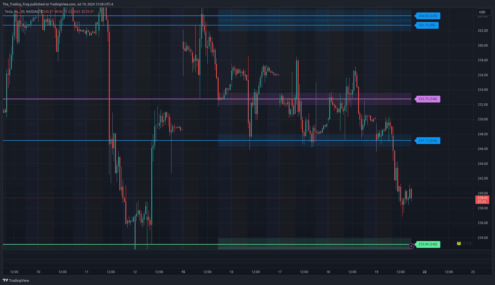

# Configuration

## Accessing the Settings

:::info
 To access the indicator settings you can either double click on one of the price labels or open the settings from the cog icon in the indicator drop down as seen in the video below.
:::

<video src="/access_settings.webm" controls width="100%" type="video/webm"></video>

## Presets

There are many options for this indicator. To help get new users up and running there are several included presets.

* Analysis Presets affect Analysis Length Selection, merge lines of different types, and % difference for merging.
* Color Presets affect Line Style color selections. 
* Layout Presets affect a variety of visual settings.

:::info
Hovering over the tool-tip next to each preset selection will provide more information about which settings are being used for that configuration.
:::

## Line Merging

When stocks have a very tight range there will sometimes be levels which are very close together. This is especially true if you have many different time periods enabled.  The indicator supports merging levels that are close together.  In the video later on this page you will see how merging helps clean up a noisy chart making it easier to read.

### Show Original Source Lines ‘Ghosts’

This will display the original levels as a faint dashed dotted line. Merging the lines can help to clean up a noisy chart but it is important to remember that these new merged levels should be treated like ranges. Having the original levels show faintly helps to drive this point home.

:::note
'Ghosts' have been made more opaque for this example. The default style is much fainter.  
:::

### Merge Threshold

This value controls what is considered “Close Enough” to be merged. Behind the scenes, this threshold is scaled for each ticker but that scaling isn’t always perfect. Adjusting the Merge Threshold allows the user to strike the perfect balance.

**How do you know when the 'Merge Threshold' should be adjusted?**

 The video below shows how changing the value affects the levels. At the start you will notice that there are a lot of levels that are essentially the same and are not adding new value to the chart. When the merge threshold is increased these duplicates disappear and the chart is easier to read while still retaining all the critical level information. At the end when the merge threshold is too high you will see that there has been a loss of detail where certain areas are no longer captured. Striking this balance takes a bit of practice but once you have done it a few times it will become second nature.

<video src="/adjusting_merge_threshold_example.webm" controls width="100%" type="video/webm"></video>

#### Small Caps

For **Small** cap stocks ( Typically under $15 ) I have found the best 'Merge Threshold' normally falls between **1** and **3**

#### Large Caps

For **Large** caps stocks ( Typically over $15 ) I have found the best 'Merge Threshold' normally falls between **.2** and **.5**

## Analysis Periods

These lines are generated by an external tool and then loaded into  TradingView. As such the levels are based on static ranges of price data. To allow for flexibility, multiple time ranges (number of bars) are analyzed and can be toggled in the settings.  A common way to leverage this is to study the chart and identify the range which captures the price movements you want to include in your SR analysis and then choose the length in the settings that encapsulates the range. You can enable as few or as many periods as you want.  

:::info
Experiment with which timeframes are being displayed on each chart until you find the combination that seems to be most respected. 
:::

 When a ticker is making new highs / lows (i.e. breaking out of its previous historical range), the lower timeframe analysis periods help to get more up to date levels. These shorter term levels will capture more of the intraday price action but can also be weaker than the longer term ones so scale your positions accordingly.

:::note
At the start of this video you can see that there is a bunch of price action above 220 where the longer analysis period levels have not caught up. By turning the 30 day levels on we can capture this price action.  
:::

<video src="/showing_missing_lines_analysis_period_selection.webm" controls width="100%" type="video/webm"></video>

Below is an example where more granularity was needed. On this TSLA chart you can see that with only the 90 and 240 'Analysis Periods' enabled there are some areas of the chart that look like interesting pivots where the S/R indicator shows no lines. In this case it is worth turning on the 30 day levels to see if they help fill in the gaps.  It is often helpful to toggle the 30 day off and on for each cart to see if it fills critical price action gaps or just clusters the chart.

Missing levels             |  30 Period Levels Added
:-------------------------:|:-------------------------:
  |  

Another use case for shorter periods is if you are trying to scalp based on a large move in the last 1-4 days. In this case, enabling the 5 day levels can show short term levels to day trade around.

