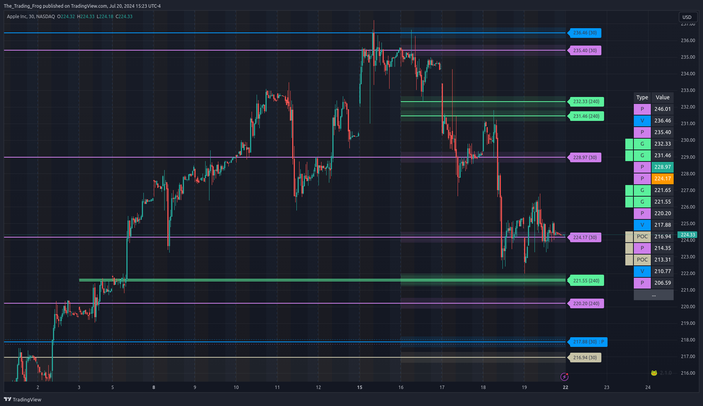
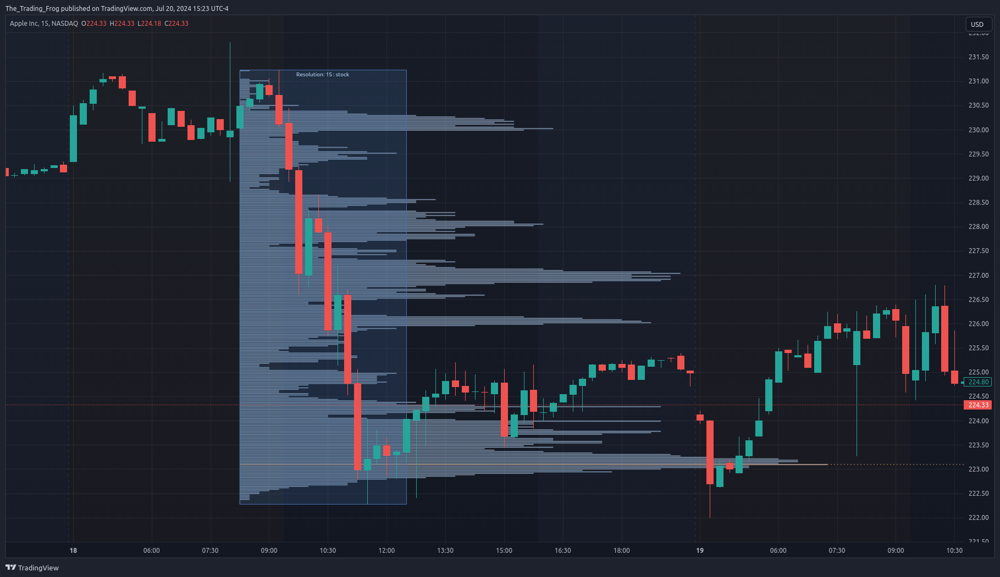

# Welcome

## What's here?

You can find the documentation for both the Support / Resistance indicator and the Volume Profile indicator here, including strategies for using them successfully and examples of trades. If you find any information missing please reach out and let me know!

## Why should I use these tools?

It takes a lot of time to figure out critical levels on a chart.  When trying to scan through a list of stocks to find the ideal setups or during a fast moving momentum play, it is essential to have these levels automatically available on your chart.  The levels show where you can add on dips or scale out on runs. Leveraging them allows you to  have a plan in place for each trade.

Other indicators use basic pivot points or simple processes to derive the levels. The FrogOracle indicator leverages vast amounts of price and volume data external to TradingView. Processing the data externally allows for more complex algorithms resulting in more accurate levels!  

The levels produced by this algorithm have been used by hundreds of traders for years as part of the FrogOracle discord tools. This indicator builds upon the strong foundation to offer expanded features right on your TradingView charts.

## Get the Indicator

:::note[Prerequisites]
If you haven't yet signed up for the indicator click the button below to get started
<Button label="Get the Indicator" link="https://www.frogoracletrading.com/get-the-indicator" variant="primary" size="lg" style={{marginBottom: '1em'}} block/>
:::

## Start Reading

Click any of the links below or in the navigation menu to start learning how to use the indicators!

### Indicators
[Support / Resistance Indicator](sr)            |  [Volume Profile Indicator](vpd)
:-------------------------:|:-------------------------:
  |  

### Strategies
A collection of strategies that leverage the S/R indicator, Volume Profile, and Fibonacci Retracements and Extensions.

[View Strategies](strategies/sr_strategies.md)

### Example Trades

A collection of trades showing off how to use the indicators.

[View Examples](example_trades/examples.mdx)
